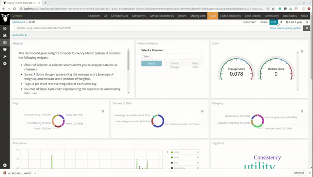

## Phase 2: Coding Period 2

#### Week 5 : SUMMARY -

1. Added an SCMS Supybot enricher for enriching IRC discussions. Added context as 'IRC-channel-name discussions' (eg 'grimoirelab discussions/chaoss discussions')

2. Added Author information in all enrichers.(scmsgithub, scmsmbox, scmssupybot). 

3. Added `Category` and `Weight` to all records.

4. Made a Dashboard 

	

4. Weekly Blog: [Dashboard and IRC enrichers](https://medium.com/@guptaria/week-5-coding-period-2-53b8ea29418c)

