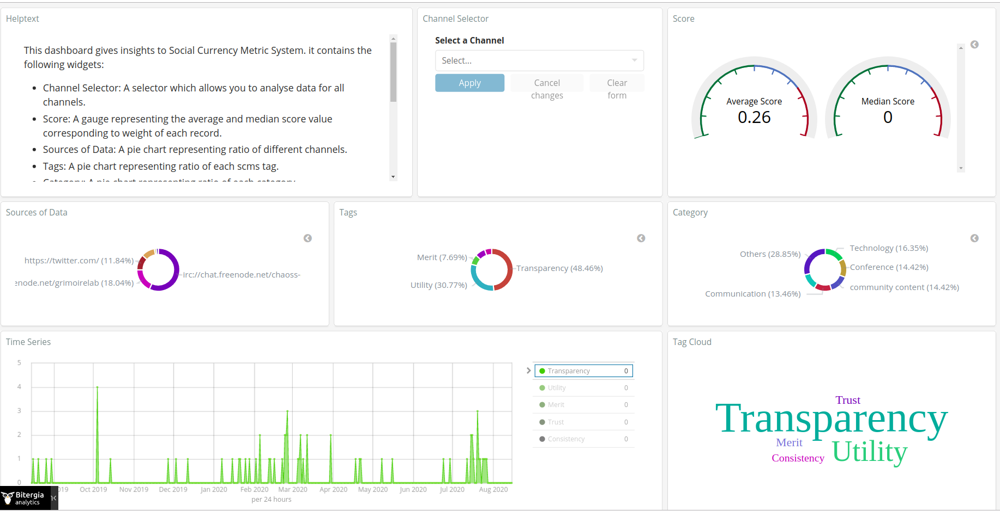
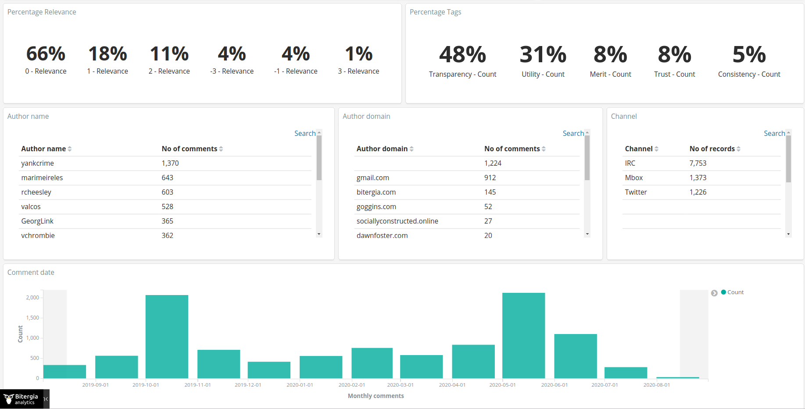

## Phase 3: Coding Period 3

#### Week 10 : SUMMARY -

1. Built a dashboard for CHAOSS with 200 records from channels- Mails, IRC, Twitter. Made some inferences with respect to the dashboard. 
	
	

2. Tagged data for CHAOSS SCMS sheet: [Spreadsheet](https://docs.google.com/spreadsheets/d/1wXBO-Xvgm7qWcgqDSMBfnXhUMEMX3N-zQEnnGZeQktE/edit?usp=sharing) - Now we have 200+ records tagged!

3. Weekly Blog: [A sneak peek into the dashboard]

4. Analysis & Calibration Meeting: [2020-08-14](https://github.com/ria18405/GSoC/blob/master/Meetings/2020-08-14-coding-prd-3-2.txt)