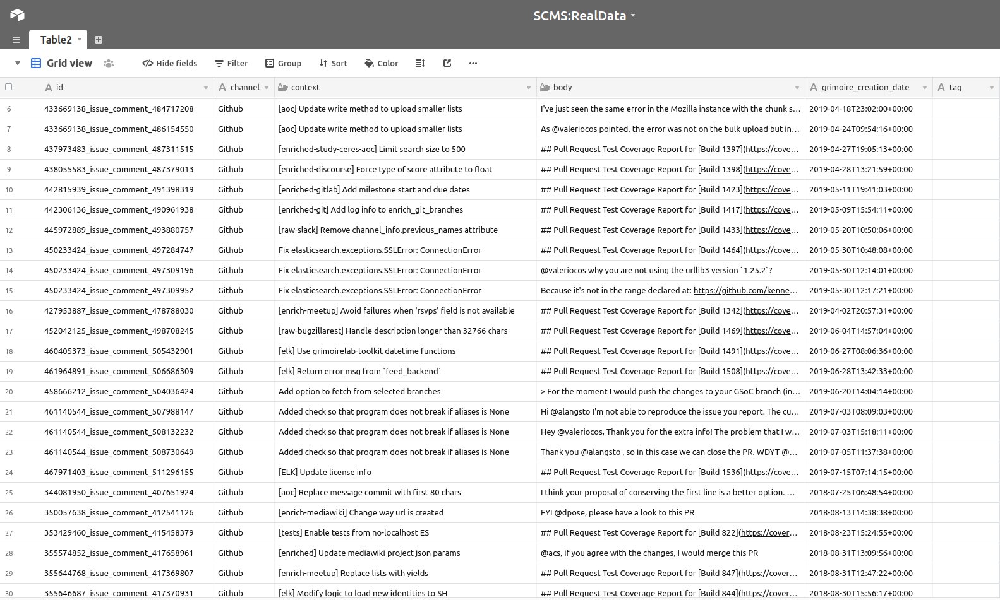
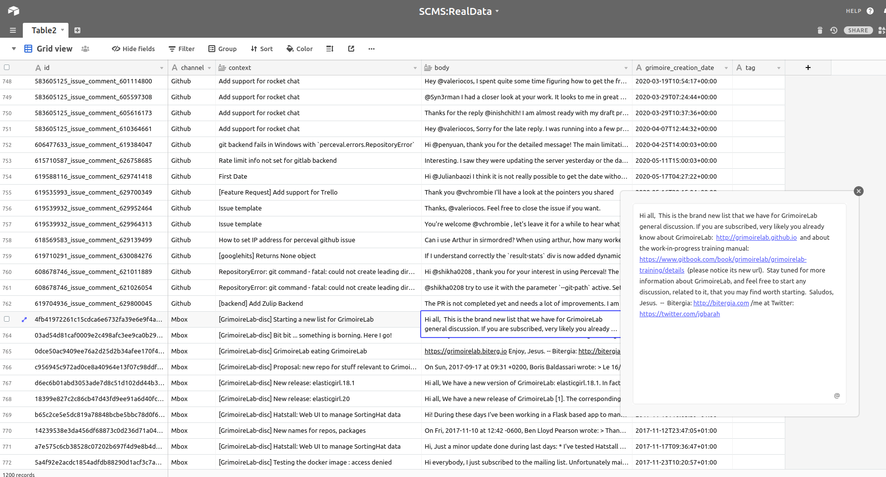

## Phase 1: Coding Period 1 

#### Week 1 : SUMMARY -

1. Made a list of all data attributes which need to be extracted. 

	* ID (Data Identifier)

	* Channel(Data Source)

	* Grimoire-creation-date (date of github comment/mail)

	* Context (Subject of mail/Title of Github issue/PR title)

	* Body (Body of the comment/mail)

2. Made enrichers for Github, Mbox which only enrich the data attributes mentioned above. 

3. Extracted enriched data by enriching raw indexes, and executing Elastic dump on it.

* Github:
	* Grimoirelab-perceval
	* Grimoirelab-ELK

* MBox:
	* Grimoirelab mailing list

4. Made an alias by the name of "all_scms" which will contain all scms enriched indexes under it.

5. Writing a scipt [ES2Excel](https://github.com/ria18405/GSoC/tree/master/Work/Coding%20period%201/Week%201/ES2Excel.py) which converts aliased Enriched index to a CSV file, xls file, Airtable view.

6. [Weekly Blog](https://medium.com/@guptaria/week-1-coding-period-1-cf83e4846308)

