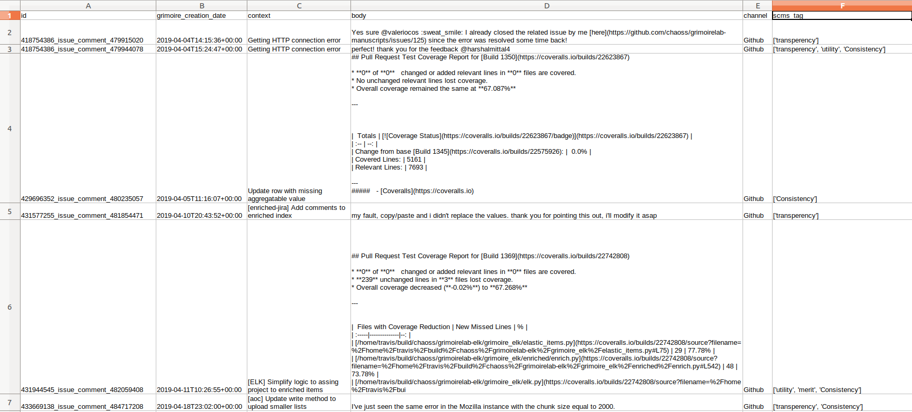
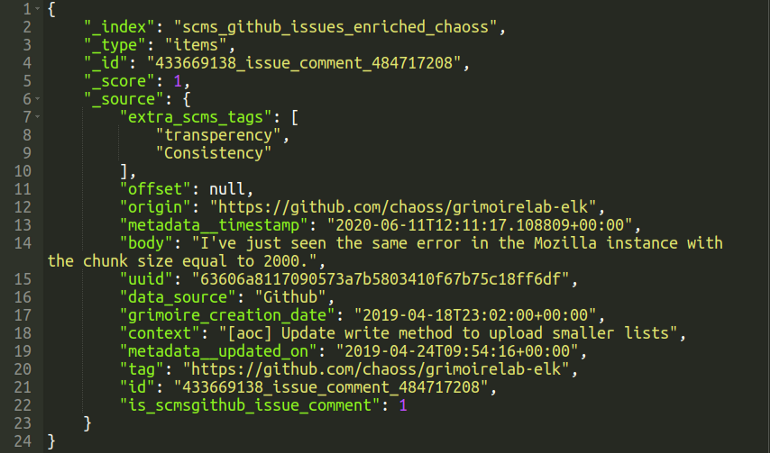

## Phase 1: Coding Period 1 

#### Week 2 : SUMMARY -

1. Randomly tagged the extracted dataset on the basis of all combinations of the 5 metrics: Trust, Transparency, Merit, Utility, Consistency.
    
    

2. Converted the Excel data to the elasticsearch indexes with the help of enrich_extra_study

	* Making a json file: https://gist.githubusercontent.com/ria18405/630346bac7856658fd19ed63bce4d9c0/raw/687bec24b7739d06f8bdde110c6f9702663c01d3/json_file.json
	```
	[
    {
        "conditions":[
            {
                "field":"id",
                "value":"418754386_issue_comment_479915020"
            }
        ],
        "set_extra_fields":[
            {
                "field":"scms_tags",
                "value":[
                    "transperency"
                ]
            }
        ]
    },
    {
        "conditions":[
            {
                "field":"id",
                "value":"418754386_issue_comment_479944078"
            }
        ],
        "set_extra_fields":[
            {
                "field":"scms_tags",
                "value":[
                    "transperency",
                    "utility",
                    "Consistency"
                ]
            }
        ]
    }
    ]
	```

	* Editing setup.cfg to include study :
	```
        [scmspipermail]
        raw_index = scmspipermail_chaoss_raw
        enriched_index = scmspipermail_chaoss_enriched
        no-ssl-verify = true
        studies = [enrich_extra_data:scmspipermail]
 
        [enrich_extra_data:scmspipermail]
        json_url = https://gist.githubusercontent.com/ria18405/630346bac7856658fd19ed63bce4d9c0/raw/687bec24b7739d06f8bdde110c6f9702663c01d3/json_file.json
        
        [scmsgithub]
        raw_index = scms_github_issues_chaoss_raw
        enriched_index = scms_github_issues_chaoss_enriched
        api-token = xxxx
        sleep-for-rate = true
        no-archive = true
        category = issue
        sleep-time = 300
        studies = [enrich_extra_data:scmsgithub]
 
        [enrich_extra_data:scmsgithub]
        json_url = https://gist.githubusercontent.com/ria18405/630346bac7856658fd19ed63bce4d9c0/raw/687bec24b7739d06f8bdde110c6f9702663c01d3/json_file.json
	```

	* Executing 'enrich_extra_data' study.

	* Output: The ElasticSearch index has added a new attribute : "extra_scms_tags" 
	
	    


3. Added a 3rd data source i.e IRC for data Analysis. Performed Elasticdump on raw IRC data, and then converted ES index to a similar Excel Sheet. 

4. Weekly Blog : [Week2 Blog](https://medium.com/@guptaria/week-2-coding-period-1-c6b103dee0ce)