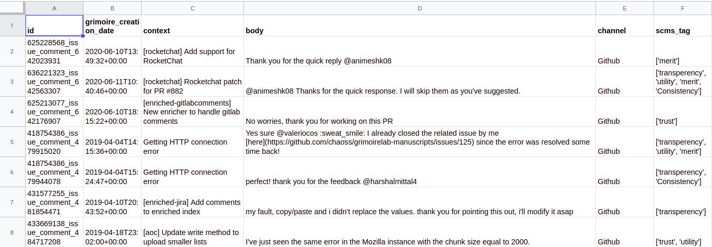
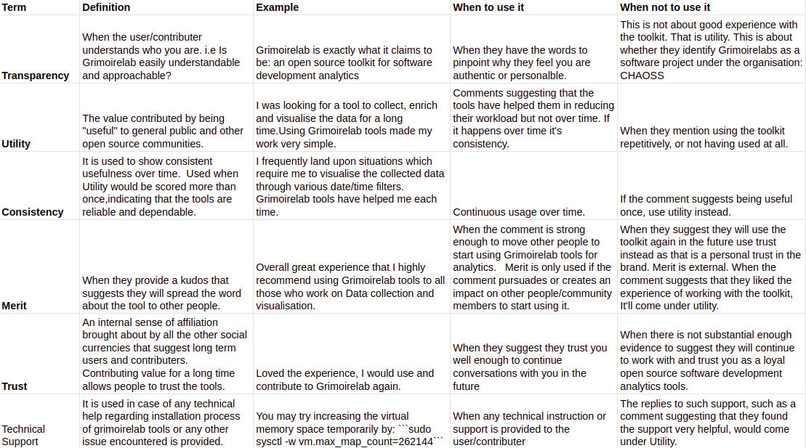

## Phase 1: Coding Period 1 

#### Week 3 : SUMMARY -

1. Exporting CSV to Google Sheets using API: Due to Airtable's record limitation of 1200 records,I collected all data from Github, Mailing lists of Grimoirelab and IRC channel of CHAOSS. Then, randomly tagged it (as done in Week 2), and exported to Google Sheets using an API.
	

2. Made a codex sheet which consisted of "when to use" and "when-not-to-use" a metric. Contains modified definitions of these metrics wrt Grimoirelabs
	

3. Filtered non-usefull data like: the IRC comments pertaining to people joining/ leaving the channel, and github commments by coveralls to indicate the coverage increased/decreased.

4. Converted this entire Excel sheet data to the ElasticSearch index (exactly as done in Week 2). The only difference is the number of records being used. Earlier, I could only have limited records containing the "extra_scms_data" in the Enriched index, Now, every meaningful record(i.e ignoring comments by coveralls) has an additional field present in its ElasticSearch index.

5. Blog: [Week 3 Blog](https://medium.com/@guptaria/week-3-coding-period-1-e0f53643ee74)

